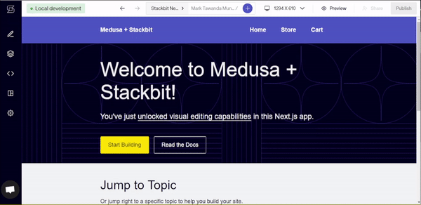

# How to Build an ecommerce site using Medusa, Next.js and Stackbit

This repository serves as a code container for the tutorial with the above title.

## App Demo



## Prerequisites

- Node v14.x.x up to Node v18.x.x (LTS)
- Git

## Getting Started

- Clone the repo
```bash
git clone https://github.com/Marktawa/medusa-stackbit-app.git
```

- Change directory
```bash
cd medusa-stackbit-app
```

## Medusa Setup

- Install the Medusa CLI
```bash
npm install -g @medusajs/medusa
```

- Change directory to `medusa-store`.
```bash
cd medusa-store
```

- Install dependencies
```bash
npm install
```

- Run the Medusa server
```bash
medusa develop
```

> Your local Medusa Server will run on port **9000**

## Next.js Setup

- Change directory to `my-stackbit-site` directory
```bash
cd my-stackbit-site
```

- Install dependencies
```bash
npm install
```

- Run the Next.js development server
```bash
npm run dev
```

> Your local Next.js dev server will run on port **3000**

## stackbit Setup

- Install Stackbit CLI
```bash
npm install -g @stackbit/cli
```

- Run Stackbit development server
```bash
cd my-stackbit-site
stackbit dev
```

> Your local Stackbit dev server will run on port **8090**
---

> For detailed instructions, [read the blog](https://dev.to).

## Authors

- [Mark Tawanda Munyaka](https://github.com/Marktawa)

## Extra

- You are welcome to make [issues and feature requests](https://github.com/Marktawa/medusa-stackbit-app/issues).


